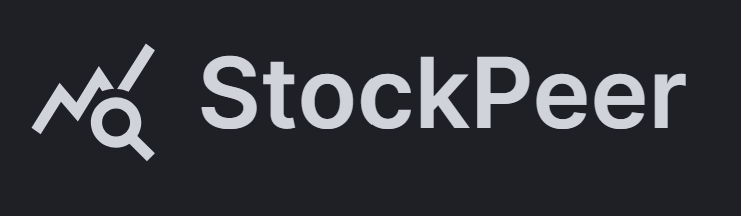
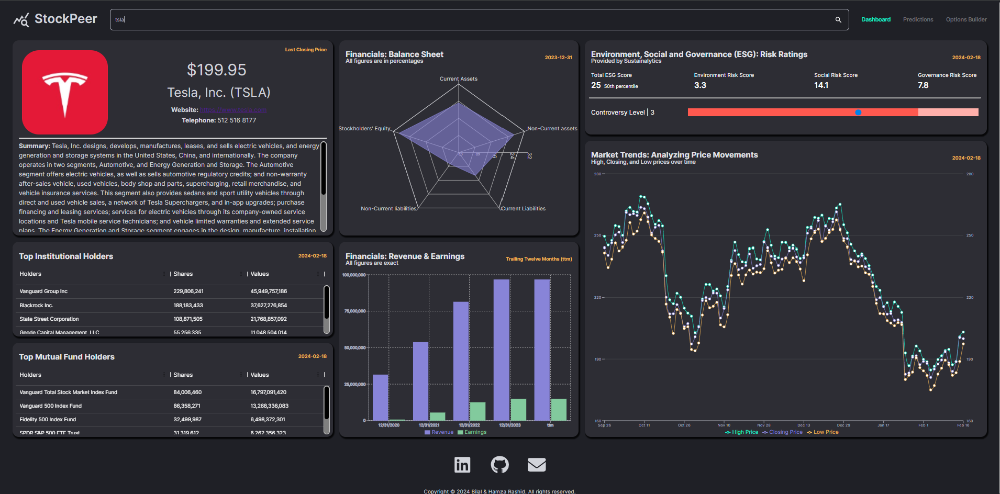
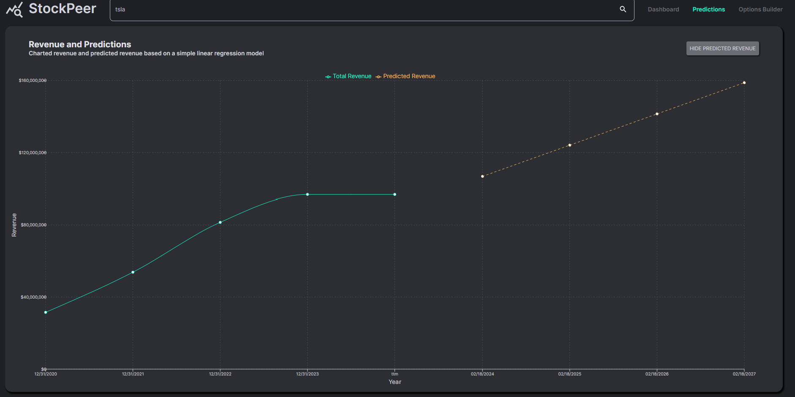
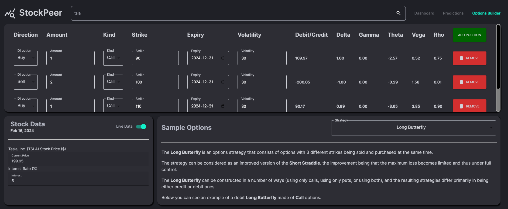
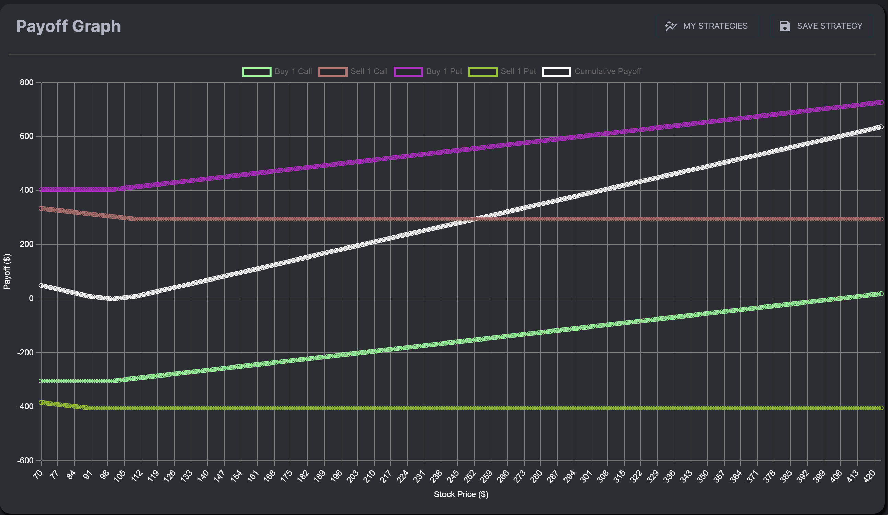

<a name="readme-top"></a>

<!-- PROJECT LOGO -->
<br />
<div align="center">
  <a href="https://stockpeer-3495602137c6.herokuapp.com/">
    
  </a>

<h2 align="center">StockPeer: Crafting Alpha through Data and Strategies</h3>

  <p align="center">
    A stock web application with display metrics for live data, machine-learning       based predictions and options strategy visualizer.
  </p>

  # <a href="https://stockpeer-3495602137c6.herokuapp.com/">Live Demo</a>

</div>


<!-- TABLE OF CONTENTS -->
<details>
  <summary>Table of Contents</summary>
  <ol>
    <li><a href="#about-the-project">About The Project</a></li>
    <li><a href="#major-technologies-used">Major Technologies Used</a></li>
    <li><a href="#installation">Installation</a></li>
    <li><a href="#usage">Usage</a></li>
    <li><a href="#next-steps">Next Steps</a></li>
    <li><a href="#license">License</a></li>
    <li><a href="#contact">Contact</a></li>
    <li><a href="#acknowledgments">Acknowledgments</a></li>
  </ol>
</details>


<!-- ABOUT THE PROJECT -->
## About The Project

The goal of this project was to create a full-stack web application where users could leverage live stock data to accomplish three tasks:

1. <strong>Stock Analysis (Dashboard page)</strong>: By entering the appropriate stock ticker or company name in the search bar, there will be 6 dashboards populated, giving the trader a comprehensive view of the company, starting column-wise:
    <br>
    - Profile: This box displays live stock data subject to open market days with the investor website and phone number. In addition, there will be a summary of the company as well.
    - Holders: The next two boxes display the top 5 institutional and mutual fund holders with the number of shares and their respective values.
    - Balance Sheet: This box gives you a visual breakdown of the Balance Sheet using a simple radar chart, where Total Assets = Total Liabilities and Stockholder's Equity.
    - Revenue & Earnings: This box gives a visual breakdown using a bar chart for the company's revenue and earnings for the most recent years.
    - Risk Ratings: This box gives you the Environment, Social, and Governance ratings for the company provided by Sustainalytics. The individual risk scores are out of 10.
    - Price Movements: The last box shows the latest high, closing, and low price for the stock.



2. <strong>Revenue Predictions (Predictions page)</strong>: Using a simple linear regression model, we predict the revenue for the next 4 years for a particular stock.



3. <strong>Options Strategy Visualizer (Options Builder page):</strong> This page allows you to build a custom options strategy using live stock data and calculates option price and Greeks.

    - The first row allows you to add and remove as many options as you want with the ability to customize components (direction, amount, kind, strike, and expiry). Changing any one component automatically updates the price and Greeks according to the Black-Scholes formula.

    - The second row shows two boxes. The first is for Stock Data with adjustable price (live price using a toggle button) and interest rate. The second box shows a list of sample strategies with explanations to help the investor get started.

    - The last row displays the payoff graph for the options strategy built using the first two rows. It also lets you save your strategy and access it upon sign-up.




<p align="right">(<a href="#readme-top">back to top</a>)</p>

<!-- TECHNOLOGIES -->
### Major Technologies Used

##### Front-End:
[](https://reactjs.org/)
[](https://vitejs.dev/)
[](https://www.typescriptlang.org/)
[](http://recharts.org/)
[](https://material-ui.com/)
[](https://www.mongodb.com/)


##### Back-End:
[](https://expressjs.com/)
[](https://axios-http.com/)
[](https://nodejs.org/)
[](https://cheerio.js.org/)
[](https://developer.mozilla.org/en-US/docs/Web/API/WebSocket)


<p align="right">(<a href="#readme-top">back to top</a>)</p>


## Installation

Please follow instructions below to install and run the project on your local device.


1. Clone the repository.
   ```sh
   git clone https://github.com/mh2rashi/StockPeer.git
   ```
2. Install NPM packages in client and server folders.
   ```sh
   cd server && npm install
   cd client && npm install
   ```

3. Get a free API Key at [Finnhub Stock API.](https://finnhub.io/)

4. Enter your API in `client/.env.local` file.
   ```sh
   API_TOKEN = 'ENTER YOUR API'
   ```

5. Run the the development server on your local machine.
    ```sh
    cd server && npm run dev
    ```

<p align="right">(<a href="#readme-top">back to top</a>)</p>


## Usage

Please access the [Live Demo](https://stockpeer-3495602137c6.herokuapp.com/) for this project. Enter an appropriate ticker to view real-time stock prices subject to US market hours.

<p align="right">(<a href="#readme-top">back to top</a>)</p>


## Next Steps

- Integrate real-time stock prices into the price graph on the Dashboard page.
- Integrate a more interactive price graph with zoom-in/zoom-out functionality, custom time horizon, and candlestick patterns.
- Add a new page with backtesting functionality to test custom option strategies.
- Add more advanced machine-learning models to predict other metrics for the stock, such as price, etc.
- Add functionality to compare two or more stocks simultaneously.


<p align="right">(<a href="#readme-top">back to top</a>)</p>


<!-- LICENSE -->
## License

Distributed under the MIT License. See `LICENSE.txt` for more information.

<p align="right">(<a href="#readme-top">back to top</a>)</p>

<!-- CONTACT -->
## Contact

Hamza Rashid

- Email : hamza022697@gmail.com
- LinkedIn: https://www.linkedin.com/in/mhamza-rashid/

Bilal Rashid

- Email: bilal0197@gmail.com
- LinkedIn: https://www.linkedin.com/in/bilal-rashid-a04625198/

<p align="right">(<a href="#readme-top">back to top</a>)</p>


<!-- ACKNOWLEDGMENTS -->
## Acknowledgments

I would like to thank Ed Roh for inspiring the [project idea](https://www.youtube.com/watch?v=uoJ0Tv-BFcQ&t=52s), and my heartfelt gratitude goes to my brother and partner for this project, Bilal Rashid.

<p align="right">(<a href="#readme-top">back to top</a>)</p>


